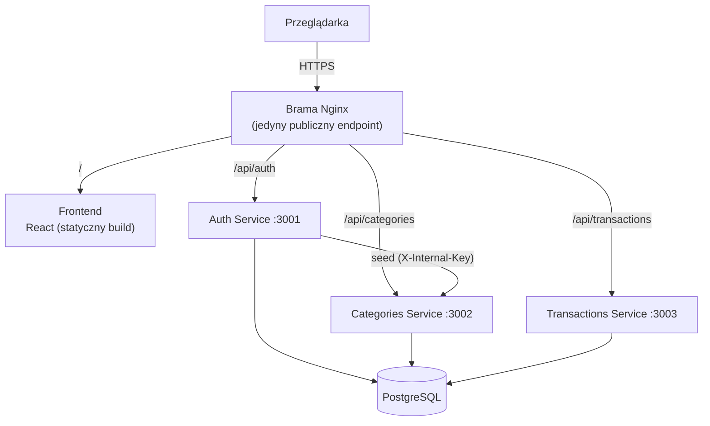

# Personal Finance Tracker

[](https://github.com/Peter-Ka-hub/personal-finance-tracker/actions/workflows/ci.yml)


**🔗 Live demo:** https://ca-gateway.wonderfulsand-f41bf9c3.polandcentral.azurecontainerapps.io
&nbsp;·&nbsp; **📘 API:** [docs/openapi.yaml](docs/openapi.yaml)
&nbsp;·&nbsp; **🛠️ Dziennik problemów:** [docs/PROBLEMY-I-ROZWIAZANIA.md](docs/PROBLEMY-I-ROZWIAZANIA.md)

Aplikacja do śledzenia finansów osobistych: rejestracja/logowanie, kategorie przychodów
i wydatków, dodawanie i przeglądanie transakcji oraz wykresy. Zbudowana jako **architektura
mikroserwisowa** (React + 3 serwisy Node/Express + brama Nginx + PostgreSQL), z pełnym
potokiem **CI/CD** i **Infrastructure as Code** (Bicep), wdrażana na **Azure Container Apps**.

> Projekt portfolio. Punktem wyjścia był monolit CRUD; został przemigrowany do mikrousług,
> uzupełniony o testy, konteneryzację i automatyczne wdrożenie. Pełny dziennik realnych problemów
> napotkanych aż do produkcji znajduje się w [docs/PROBLEMY-I-ROZWIAZANIA.md](docs/PROBLEMY-I-ROZWIAZANIA.md).

## Stack technologiczny

| Warstwa            | Technologie |
|--------------------|-------------|
| Frontend           | React 19, React Router 7, React Query, Recharts, Tailwind CSS, Axios |
| Backend (×3)       | Node.js, Express 5, Sequelize, JWT, bcrypt |
| Brama / routing    | Nginx (reverse proxy) |
| Baza danych        | PostgreSQL 16 |
| Testy              | Jest + Supertest (unit), Node test runner (e2e) |
| Konteneryzacja     | Docker, docker-compose |
| CI/CD              | GitHub Actions |
| Chmura / IaC       | Azure Container Apps, Azure PostgreSQL, Bicep |

## Architektura



- **Brama Nginx** to jedyny publiczny punkt wejścia — frontend i serwisy są wewnętrzne.
  Frontend woła API relatywnie pod `/api`, więc **nie ma problemu z CORS**.
- **Auth** wystawia JWT (HS256); pozostałe serwisy weryfikują token middlewarem.
- Po rejestracji Auth woła Categories i **zasiewa 10 domyślnych kategorii** dla użytkownika —
  to wywołanie wewnętrzne, chronione nagłówkiem `X-Internal-Key`, a nie JWT użytkownika.

## API (przez bramę, prefiks `/api`)

| Metoda | Ścieżka                  | Auth        | Opis |
|--------|--------------------------|-------------|------|
| POST   | `/api/auth/register`     | —           | Rejestracja; zwraca JWT i zasiewa kategorie |
| POST   | `/api/auth/login`        | —           | Logowanie; zwraca JWT |
| GET    | `/api/categories`        | JWT         | Lista kategorii użytkownika |
| POST   | `/api/categories`        | JWT         | Dodanie kategorii |
| DELETE | `/api/categories/:id`    | JWT         | Usunięcie kategorii |
| POST   | `/api/categories/seed`   | `X-Internal-Key` | Zasiew domyślnych kategorii (wewnętrzny) |
| GET    | `/api/transactions`      | JWT         | Lista transakcji użytkownika |
| POST   | `/api/transactions`      | JWT         | Dodanie transakcji |
| DELETE | `/api/transactions/:id`  | JWT         | Usunięcie transakcji |

Każdy serwis wystawia też `GET /health`.

## Uruchomienie lokalne

Wymagania: Docker + docker-compose.

```bash
# 1. Skonfiguruj zmienne środowiskowe
cp .env.example .env        # następnie uzupełnij hasła/sekrety

# 2. Zbuduj i uruchom cały stack
docker compose up --build

# 3. Otwórz aplikację
#    http://localhost  (brama na porcie 80)
```

Zmienne środowiskowe (`.env`) — wszystkie sekrety pochodzą stąd, nic nie jest zaszyte w kodzie:

| Zmienna            | Opis |
|--------------------|------|
| `DB_USER` / `DB_PASSWORD` / `DB_NAME` | Dane logowania PostgreSQL |
| `JWT_SECRET`       | Sekret do podpisu JWT (min. 32 znaki) |
| `INTERNAL_API_KEY` | Klucz wywołań wewnętrznych (auth → categories) |

## Testy

```bash
# Testy jednostkowe danego serwisu (baza mockowana)
cd services/auth && npm ci && npm test          # auth / categories / transactions

# Testy frontendu
cd frontend && npm ci && npm test -- --watchAll=false

# Testy e2e przez bramę (wymaga uruchomionego docker-compose)
node --test e2e/app.test.mjs
```

## CI/CD

- [`.github/workflows/ci.yml`](.github/workflows/ci.yml) — przy każdym PR/push: testy jednostkowe
  (matryca 3 serwisów), build + testy frontendu, testy **e2e** na świeżo postawionym docker-compose.
- [`.github/workflows/deploy.yml`](.github/workflows/deploy.yml) — wdrożenie na Azure dopiero po
  zielonych testach: `base.bicep` (ACR, PostgreSQL) → build i push 5 obrazów → `apps.bicep`
  (5 Container Apps). Logowanie do Azure przez **OIDC** (bez długożyciowych sekretów).

## Struktura repozytorium

```
.
├── frontend/            # Aplikacja React (CRA + Tailwind)
├── services/
│   ├── auth/            # Rejestracja, logowanie, wydawanie JWT
│   ├── categories/      # Kategorie + zasiew domyślnych
│   └── transactions/    # CRUD transakcji
├── gateway/             # Brama Nginx (reverse proxy)
├── infra/               # Bicep (base.bicep, apps.bicep, modules/)
├── e2e/                 # Testy end-to-end przez bramę
├── docs/                # Dziennik problemów i rozwiązań
└── docker-compose.yml   # Lokalny stack
```

## Czego ten projekt dowodzi

- Projektowanie i migracja do **architektury mikroserwisowej** z bramą API.
- Bezpieczeństwo: hasła hashowane bcrypt, autoryzacja JWT, walidacja wejścia (Zod), nagłówki
  bezpieczeństwa (Helmet), rate limiting na endpointach auth, sekrety poza kodem, ruch wewnętrzny
  chroniony osobnym kluczem.
- **Pełna automatyzacja**: testy jednostkowe + e2e w CI, IaC w Bicep, wdrożenie na Azure przez OIDC.
- **Debugowanie produkcyjne**: 21 udokumentowanych, realnych problemów (HTTP 426 na bramie,
  globalne limity Azure, wyścigi startowe w CI, OIDC) — zob.
  [docs/PROBLEMY-I-ROZWIAZANIA.md](docs/PROBLEMY-I-ROZWIAZANIA.md).
